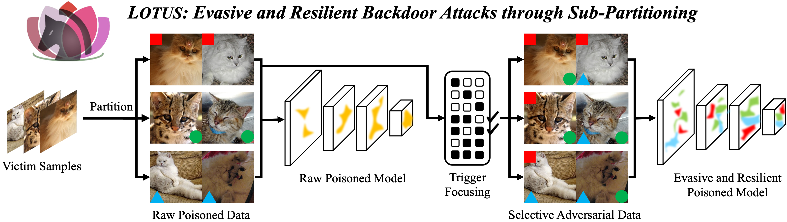

<div align="center">
    
</div>

# LOTUS: Evasive and Resilient Backdoor Attacks through Sub-Partitioning


Table of Contents
=================
- [Table of Contents](#table-of-contents)
  - [Overview](#overview)
  - [Code Architecutre](#code-architecture)
  - [Environments](#environments)
  - [Experiments](#experiments)
    - [Usage](#usage)
    - [Configurations](#configurations)
    - [Outputs](#outputs)
  - [Citation](#citation)
  - [Acknowledgement](#acknowledgement)

## Overview
- This is the PyTorch implementation for CVPR 2024 paper "[LOTUS: Evasive and Resilient Backdoor Attacks through Sub-Partitioning](https://openaccess.thecvf.com/content/CVPR2024/html/Cheng_LOTUS_Evasive_and_Resilient_Backdoor_Attacks_through_Sub-Partitioning_CVPR_2024_paper.html)".
- [[arXiv](https://arxiv.org/abs/2403.17188)\] | \[[video](https://www.youtube.com/watch?v=AoP6tlFmSqQ&t=12s)\] | \[[slides](https://www.cs.purdue.edu/homes/cheng535/static/slides/LOTUS_slides.pdf)\] | \[[poster](https://www.cs.purdue.edu/homes/cheng535/static/slides/LOTUS_poster.pdf)\]



## Code Architecture
    .
    ├── checkpoint        # Saved models
    ├── data              # Dataset folder
    ├── models            # Model architectures
    │   ├── resnet.py     # ResNet models
    │   └── vgg.py        # VGG models
    ├── dataset.py        # Dataset processing function
    ├── main.py           # Main function
    ├── partition.py      # (Implicit) partioning function
    ├── train.py          # Training function
    ├── trigger.py        # Trigger function
    └── utils.py          # Utility functions

## Environments
```bash
# Create python environment (optional)
conda env create -f environment.yml
source activate lotus
```

## Experiments  
We provide example code snippets for CIFAR-10 dataset. These can be easily plugged in and modified in `./utils.py`, specifically within the `get_dataset(*)` functions.

### Usage
To train and evaluate a backdoored model using LOTUS, run:
```bash
python main.py --gpu 0
```
It involves three steps to launch LOTUS:
- Step 1 (Line 32): Train a clean model.
- Step 2 (Line 35): Train a surrogate model for partitioning.
- Step 3 (Line 38): Poison the model with backdoor triggers.

### Configurations
The specific arguments and hyperparameters used to launch LOTUS can be found in `./main.py`, particularly in lines 45-61.

| Hyperparameter | Default Value | Description |
|----------------|---------------|-------------|
| gpu | "0" | GPU ID used to launch the experiment. |
| dataset | "cifar10" | The utilized dataset. |
| network | "resnet18" | The utilized model architecture. |
| victim | 0 | The attack victim label. |
| target | 9 | The attack target label. |
| cluster | "kmeans" | Partitioning method. |
| num_par | 4 | Number of sub-partitions. |
| n_indi | 3 | Number of individual negative samples used in Trigger-focusing. |
| n_comb | 1 | Number of combined negative samples used in Trigger-focusing. |
| batch_size | 128 | Batch size for training. |
| epochs | 100 | Total number of training epochs. |
| seed | 1024 | Random seed for reproducibility. |


### Outputs
Several output files will be saved in the directory `./checkpoint`.
- `./checkpoint/clean.pt`: Clean model.
- `./checkpoint/lotus_best.pt`: Best backdoored model.
- `./checkpoint/lotus_final.pt`: Final backdoored model.
- `./checkpoint/result.json`: ASRs of different combinations of trigger and partition.
- `./checkpoint/surrogate.pt`: Surrogate model for partitioning.
- `./checkpoint/training.log`: Training logs.


## Citation
Please cite our paper if you find it useful for your research.😀

```bibtex
@inproceedings{cheng2024lotus,
  title={Lotus: Evasive and resilient backdoor attacks through sub-partitioning},
  author={Cheng, Siyuan and Tao, Guanhong and Liu, Yingqi and Shen, Guangyu and An, Shengwei and Feng, Shiwei and Xu, Xiangzhe and Zhang, Kaiyuan and Ma, Shiqing and Zhang, Xiangyu},
  booktitle={Proceedings of the IEEE/CVF Conference on Computer Vision and Pattern Recognition},
  pages={24798--24809},
  year={2024}
}
```

## Acknowledgement
- [BackdoorVault](https://github.com/Gwinhen/BackdoorVault)
- [OrthogLinearBackdoor](https://github.com/KaiyuanZh/OrthogLinearBackdoor)
- [FLIP](https://github.com/KaiyuanZh/FLIP)
